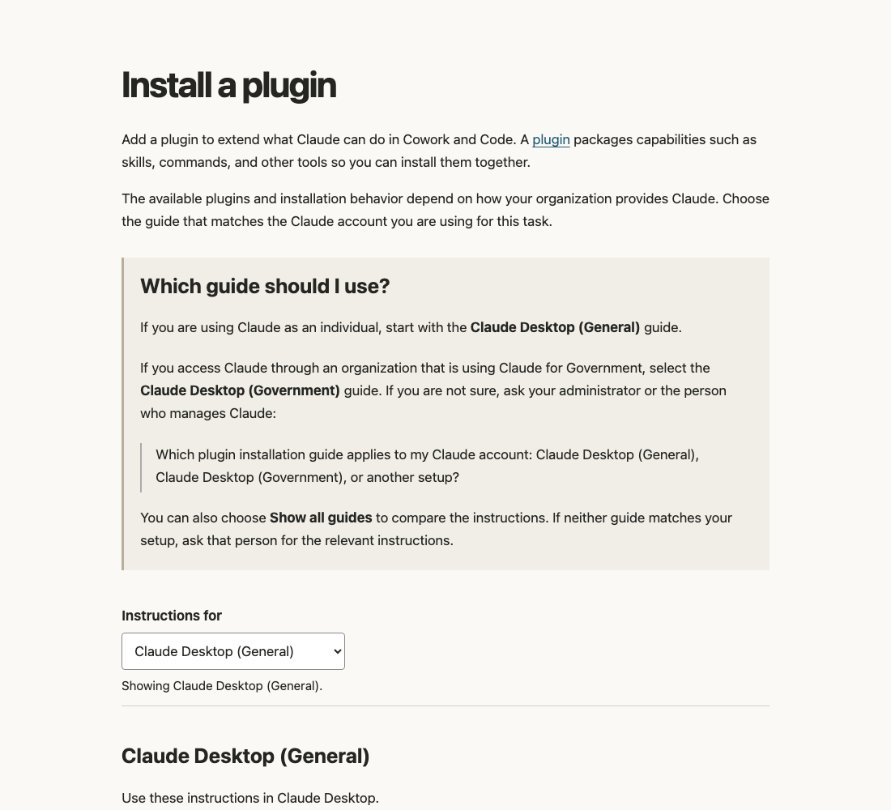

# Standards and worked rewrite

Claude Docs often write a procedure for one context, such as general Claude Desktop, and
present it as if it applies everywhere. Readers in other contexts follow the steps, hit a
dead end, and can't tell why. This excerpt of a style guide sets rules for task pages whose
steps depend on the reader's context. The worked rewrite applies those rules to
**Install a plugin**, turning two separate product pages into one task page with a
complete workflow for each context and a chooser to pick between them.

To try the chooser, download [`rewrite/build/page.html`](rewrite/build/page.html) and
open it in a browser. It's a single self-contained file. GitHub shows its source rather
than the page.

## What's here

- [Style-guide excerpt](style-guide.md): ten rules for task pages with context-dependent
  instructions. Part 3's [duplicate-prose workflow](../3-check/README.md) finds
  candidates for SHARE-01, the rule on shared explanations.
- [How-to template](how-to-template.md): the page skeleton, plus the editorial record
  each page keeps outside the published text.
- The rewrite itself:
  - Before: the [Cowork source](rewrite/snapshots/cowork--guide--plugins.md), which is
    the page being rewritten, and the
    [Government source](rewrite/snapshots/government--desktop--plugins.md), which
    supplies the second workflow.
  - After: [Markdown](rewrite/build/page.md) and the
    [interactive preview](rewrite/build/page.html).
- [What changed and why](rewrite/changelog.md): each change tied to a rule, with every
  section of the original page accounted for.

## Evidence limits

The General workflow uses UI labels from Claude Desktop as I saw it on 17 September
2026. They differ from the 14 September snapshot. The Government workflow keeps the
source's wording because I couldn't verify its current UI. The changelog lists the
[product checks still open before publication](rewrite/changelog.md#open-product-checks-before-publication).

To rebuild, edit, or add a variant, see the [rewrite README](rewrite/README.md).
