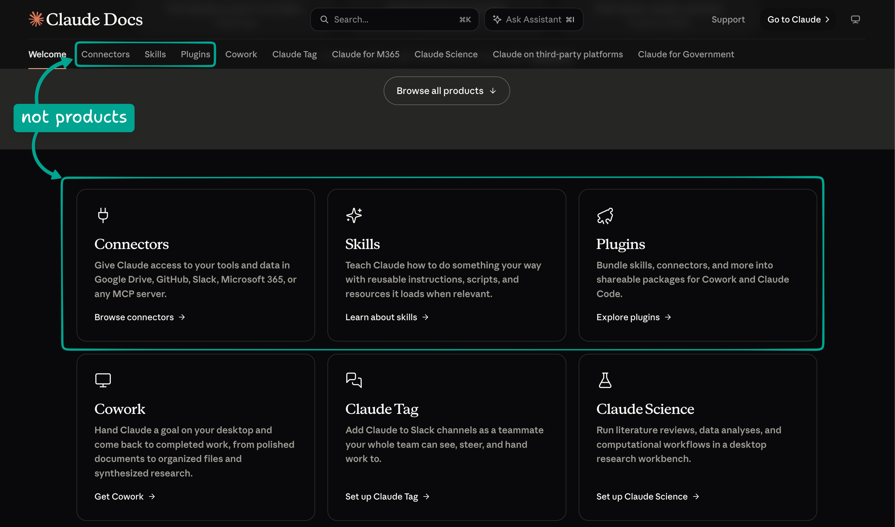
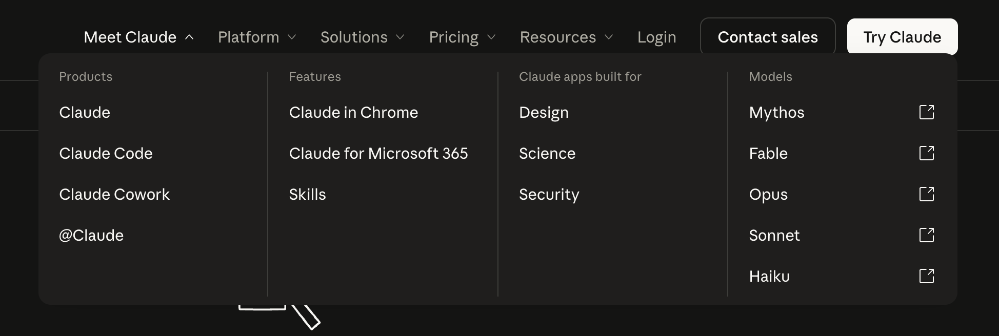

# Audit Memo

## Fix the model first

Claude Docs groups Connectors, Skills, and Plugins alongside Cowork, Claude Tag,
Claude for M365, Science, third-party platforms, and Government under
"products." But these aren't all products. The list mixes capabilities, places
to use Claude, and ways organizations provide access. It's hard to tell what's
shared across Claude and what changes with your setup.



The main site tells a different story. It lists Skills and Claude for Microsoft
365 under "Features." Even the names change: "@Claude" becomes "Claude Tag," and
"Claude Cowork" becomes "Cowork." Readers shouldn't have to sort this out before
they can find instructions.



Here's the model I'd use:

> Claude uses connectors to access tools and data, skills to follow reusable
> instructions, and plugins to package capabilities for distribution. How you
> enable, use, or administer them depends on where you use Claude and how your
> organization provides access.

I'd fix the model first. It'll help readers understand the overlap and give
writers a clearer home for each task. Organize navigation around capabilities
and tasks, then show the complete workflow for the reader's setup. Start with
the misleading setup and availability claims in the
[54-page disposition ledger](disposition-ledger.md).

## What matters most

### 1. Make it clear which instructions apply

The connector overview says you only need to authenticate. But the Microsoft 365
guide requires tenant consent and, for Team and Enterprise, organization
enablement. Tell readers what they'll need and which steps belong to an admin
before they start.

To distribute a Government skill, you'll need a text-only skill in a plugin
wrapper. Installing a Government plugin doesn't connect its bundled tools.
Uploading a Claude Tag plugin doesn't attach it to a scope. Each procedure
should say what "done" means and how to check it. See the [draft findings](audit-memo.md#fix-applicability-before-rearranging-navigation)
and [plugin evidence](plugin-disposition-example.md#evidence-and-priorities).

### 2. Separate tasks with different outcomes

Adding GitHub files and configuring GitHub MCP tools are different jobs. The
Slack page mixes an earlier app with a data connector and a route to Claude Tag.
The financial-services plugin collection sits under M365 add-ins even though its
steps target Cowork. Help readers choose the job they're trying to do before
showing them the steps. See the [connector decisions](disposition-ledger.md#connectors-for-members-and-administrators)
and [plugin decisions](disposition-ledger.md#plugins-and-distribution).

### 3. Stop maintaining competing explanations

Explain each capability once. The plugin overview doesn't need a second catalog
or a history lesson. Link to the directory and cut the detours. Put listing edits
and permanent-slug rules under listing management. Keep server and plugin updates
separate, since they're different jobs. Specialist references still earn their
own pages. The [ledger](disposition-ledger.md) covers the decisions for all 54 pages.

## Principles behind the proposal

I'd use these rules throughout. The
[content and presentation proposal](proposed-ia.md#author-complete-procedures-compose-the-readers-view)
goes into more detail.

- Give shared content one home and several ways to find it. Keep the existing
  entry points for readers who start with where they use Claude.
- Keep context choices distinct. Where you're working, how your organization
  provides access, your permissions, and your installation method aren't the same
  thing. Don't put Cowork, Government, and ZIP upload in one dropdown.
- Make the task the destination. Write complete workflows in separate Markdown
  files, then bring the right one into the task page. Readers shouldn't have to
  piece together a procedure from scattered exceptions.
- Ask for context only when it changes the steps. Put **How to check** beside the
  choice, and explain what to ask an admin if readers can't identify their setup.
  A setting that carries across tasks isn't the same as a local choice of method.
- Honor the context in a shared link, even if the reader has a different saved
  preference. Show which instructions they've landed on. Keep comparisons where
  they help readers choose, such as M365's local and remote data paths.
- Don't claim more than the evidence supports. A generic page doesn't mean a
  feature works everywhere. A missing procedure doesn't mean it's unsupported.

Give each page a clear job using Diátaxis. Tutorials teach through practice.
Explanations build understanding. How-to guides get a task done. Reference pages
make details easy to look up. Share a procedure when the person doing it, the
steps, and the outcome match. Keep complete variants when they don't. The
[Install a plugin rewrite](../2-standards/rewrite/README.md) shows how separate
sources come together on one task page.

## Proposed navigation

Here's how I'd organize **Extend Claude**. The
[full proposed tree](proposed-ia.md#organize-by-capability-and-task) expands the
service, authentication, MCP Apps, and tunnel sections.

```text
Extend Claude
├── Skills
│   ├── Understand skills
│   ├── Use and manage skills
│   ├── Create a skill with Claude or in the app
│   └── Write and test a skill package
├── Plugins
│   ├── Understand plugins
│   ├── Install a plugin
│   ├── Manage installed plugins
│   ├── Create a plugin with Claude
│   └── Financial services collection
├── Connectors
│   ├── Understand connectors
│   ├── Find or request a connector
│   ├── Understand verification labels
│   ├── Connect a service
│   ├── Add a custom connector
│   ├── Use connected tools and data
│   └── Manage a connection
├── Administer extensions
│   ├── Distribute and manage plugins, including bundled skills
│   ├── Enable connectors and set tool policies
│   ├── Set up Microsoft 365 access
│   ├── Set up GitHub tools
│   ├── Configure built-in Desktop connectors
│   ├── Set up a skills repository Claude can update
│   └── Connect a private network
└── Build and publish extensions
    ├── Choose MCP, a plugin, or both
    ├── Understand MCP
    ├── Build a connector or desktop extension
    ├── Implement authentication
    ├── Build MCP Apps
    ├── Test and troubleshoot connectors
    ├── Choose directory or custom distribution
    ├── Check submission requirements
    ├── Submit a connector or plugin
    └── Update integrations and manage listings
```

## What to merge or remove, and where old links go

We can consolidate content without moving every URL. Don't delete a duplicate
until its replacement works, and don't lose any unique workflows.

| Content decision | What readers following old URLs get |
| --- | --- |
| Share definitions and identical passages; remove duplicate catalog and promotional prose. | Existing overview URLs remain. Removed-section anchors point to the surviving explanation or directory. |
| Compose installation, management, and administration from complete workflow variants. | Multi-task URLs remain short task-choice pages with their context and real legacy anchor targets. The Government plugins URL still offers install, create, and manage. |
| Relocate the financial-services collection, Science custom connectors, and managed-Desktop GitHub and M365 setup. | Publish replacements first, then redirect the four pages with their context and heading targets preserved. |
| Consolidate listing guidance while retaining runtime and plugin update tasks. | The old after-publishing URL retains runtime guidance and routes readers to the appropriate listing or plugin task. |

The [relocation map](proposed-ia.md#preserve-incoming-intent) and
[ledger](disposition-ledger.md) show where each page goes. Check heading anchors
and `.md` routes, and update `llms.txt`. A server redirect can't read a URL
fragment. Keep the old anchor targets or handle those links in the browser, and
check that readers reach the right task and context.

## How to migrate

1. Work with doc owners to settle the claims that affect the steps: archive
   rules, availability, and legacy Slack behavior. Record the evidence and review
   date. See the [publication questions](disposition-ledger.md#publication-questions-to-resolve).
2. Watch members and admins try the current docs. That's the baseline.
3. Start with plugin installation and distribution, plus Government skill
   packaging. Then move to connector setup and administration. Each batch needs
   complete content, an owner, navigation, and working old links.
4. Test each batch with readers. Check keyboard access, shared links, print, and
   pages without JavaScript. Ship content and routing together, and keep the
   previous version and route map so we can roll back.

The [migration plan](proposed-ia.md#migrate-in-reader-testable-batches) has the
scenarios we'll use to check each batch.

## How to know it works

Have readers try the same tasks before and after. Vary the order so practice
doesn't skew the results. Compare completion, wrong-context attempts, and time
to the right instructions against the baseline.

| Question | Measure and instrumentation |
| --- | --- |
| Can readers find the right instructions? | Track whether their first destination is correct, how long it takes to find the right steps, and wrong-context attempts. Record `procedure_view` with task, variant, and selection-origin IDs. |
| Can they finish and explain the outcome? | Check what happened: did the skill load, was the plugin attached, whose consent is still needed? Pair observed completion with optional task feedback and reason categories. A page view doesn't tell us the task is done. |
| Do old links preserve intent? | Check every inventoried browser/Markdown route and rendered anchor. Browser checks verify task, context, and visible target; `legacy_route_resolved` records route IDs. Require every known mapping to pass before release. |
| Does consolidation reduce drift? | Review shared claims at each release; count independently authored duplicates and contradictions, recording corrections by claim and context. Page count alone says little. |

Use allowlisted task, variant, and route IDs in analytics. If readers switch
contexts, check why. They might be comparing workflows. See the
[detailed measurement proposal](plugin-disposition-example.md#measurement-proposal).

## Supporting drafts

- [Audit findings draft](audit-memo.md) develops the prioritized argument.
- [Disposition ledger](disposition-ledger.md) records each page's evidence,
  treatment, priority, and old-URL behavior.
- [Proposed IA and migration](proposed-ia.md) gives the full tree, destination
  scopes, and acceptance scenarios.
- [Plugin disposition example](plugin-disposition-example.md) traces one family
  through evidence, procedure ownership, old links, and measurement.
